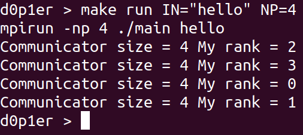
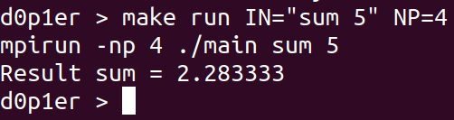
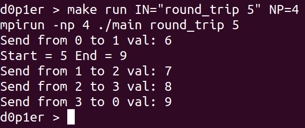
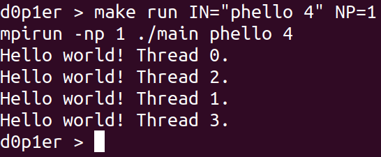
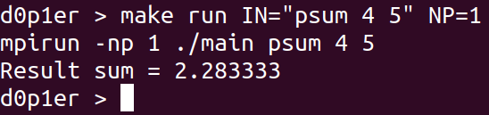
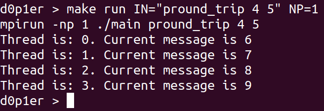

# Introduction tasks for MPI and Pthread
> sorry for my English

# Content
0. [Compile](#compile)
1. [Hello World MPI](#hello_mpi)
2. [Sum MPI](#sum_mpi)
3. [Round trip MPI](#round_mpi)
4. [Hello World Pthread](#hello_p)
5. [Sum Pthread](#sum_p)
6. [Round trip Pthread](#round_p)

<a name="compile"></a>
## 0. Compile
In root directory:
```console
make
```
If you don't have mpich, install it (linux):
```console
sudo apt install mpich
```

<a name="hello_mpi"></a>
## 1. Hello World MPI
### Start Hello World MPI:
```console
make run IN="hello" NP=4
```
Argument NP like -np in mpirun.

### Output:




<a name="sum_mpi"></a>
## 2. Sum MPI
### Start Sum MPI:
```console
make run IN="sum 5" NP=4
```
The second value in argument IN is N.

### Output:




<a name="round_mpi"></a>
## 3. Round trip MPI
### Start Round trip MPI:
```console
make run IN="round_trip 5" NP=4
```
The second value in argument IN is message start value.

### Output:




<a name="hello_p"></a>
## 4. Hello World Pthread
### Start Hello World Pthread:
```console
make run IN="phello 4" NP=1
```
The second value in argument IN is number of threads.

### Output:




<a name="sum_p"></a>
## 5. Sum Pthread
### Start Sum Pthread:
```console
make run IN="psum 4 5" NP=1
```
The second value in argument IN is number of threads. \
The third value in argument IN is N.

### Output:




<a name="round_p"></a>
## 6. Round trip Pthread
### Start Round trip Pthread:
```console
make run IN="pround_trip 4 5" NP=1
```
The second value in argument IN is number of threads. \
The third value in argument IN is message start value.

### Output:


